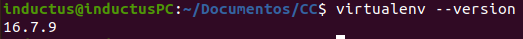

# Ejercicio 1

**Instalar alguno de los entornos virtuales de node.js (o de cualquier otro lenguaje con el que se esté familiarizado) y, con ellos, instalar la última versión existente, la versión minor más actual de la 4.x y lo mismo para la 0.11 o alguna impar (de desarrollo).**

Para este ejercicio utilizaremos el lenguaje **Python** con el que estoy familiarizado, a pesar de que lo he empezado a utilizar hace relativamente poco tiempo.

Se utilizará como entorno virtual **virtualenv**, para instalarlo utilizamos *pip*, concretamente escribimos en terminal el siguiente comando:

```shell
$ pip install virtualenv
```

Para comprobar la instalación tecleamos en terminal:

```shell
$ virtualenv --version
```
Si nos sale alguna versión instalada habremos completado el proceso correctamente. En nuestro caso nos aparece la versión  16.7.9. Como se puede ver en la siguiente captura de pantalla:




Ahora para crear un entorno virtual tenemos que introducir el siguiente comando:


```shell
$ virtualenv -p <ruta_python> env
```

Y creara una carpeta llamada *env* que contendrá el entorno virtual. Según la ruta de python que pongamos ese entorno trabajará con una versión u otra de Python, si no especificamos nada por defecto usará *Python3*.

Si queremos crear el entorno virtual con *python2.8*, tendremos que introducir en terminal el siguiente comando:

```shell
$ virtualenv -p /usr/bin/python2.8 env
```

Tener en cuenta que es necesario que tengamos instalada esta versión de Python en nuestro sistema.

Para lanzar el entorno virtual creado, tenemos que poner en terminal:

```shell
$ source env/bin/activate
```
Y para apagar este entorno virtual tenemos que escribir en terminal:


```shell
$ deactivate
```
# Ejercicio 2

**Crear una descripción del módulo usando package.json. En caso de que se trate de otro lenguaje, usar el método correspondiente.**

Al igual que en el primer ejercicio se utilizará *Python*.

Este lenguaje dispone de un fichero de texto (.txt) en el cuál se describen las dependencias, es decir, las librerías que necesitaremos que Python instale en el sistema (utilizando pip) para poder lanzar el proyecto.

Este archivo se llama: *requirements.txt*, y un ejemplo del mismo es el siguiente.

```
invoke==1.3.0
pytest==4.6.6
pytest-cov==2.8.1
codecov==2.0.15
reportlab==3.5.32
flask==1.1.1
```

Para utilizarlo e instalar todas las librerías (junto con versión) que especifica) utilizaremos la siguiente orden:

```shell
$ pip3 install -r requirements.txt
```

# Ejercicio 3


**Descargar el repositorio de ejemplo anterior, instalar las herramientas necesarias (principalmente Scala y sbt) y ejecutar el ejemplo desde sbt. Alternativamente, buscar otros marcos para REST en Scala tales como Finatra o Scalatra y probar los ejemplos que se incluyan en el repositorio.**

Rellenar ejercicio 3.

# Ejercicio 4

**Para la aplicación que se está haciendo, escribir una serie de aserciones y probar que efectivamente no fallan. Añadir tests para una nueva funcionalidad, probar que falla y escribir el código para que no lo haga. A continuación, ejecutarlos desde mocha (u otro módulo de test de alto nivel), usando descripciones del test y del grupo de test de forma correcta. Si hasta ahora no has subido el código que has venido realizando a GitHub, es el momento de hacerlo, porque lo vamos a necesitar un poco más adelante.**

Destacar que mi proyecto, lo estoy haciendo en *Python* con la librería *pytest* para la creación de los test de mis microservicios, correspondientes al proyecto de la asignatura.

Se mostrará a continuación algunas de las funciones de test implementadas para mi microservicio de Portatiles:

```python
import pytest
import sys
import os

sys.path.append('src')

import bson

from Portatiles import Portatiles
from MongoDM import MongoDM

data_manager = MongoDM(os.environ['URI_BD_P'],os.environ['BD_P'],os.environ['CO_P'])
nueva_lista = Portatiles(data_manager)

def test_lista_portatiles_vacia():
    nueva_lista.limpiarLista()
    assert nueva_lista.numeroPortatilesEnBD() == 0
    assert nueva_lista.seleccionarPortatil("1") == False
    nueva_lista.limpiarLista()

def test_agregar_nuevo_portatil():
    nueva_lista.limpiarLista()
    indice = nueva_lista.agregarPortatil("MSI","GL62M","333X",2000)
    assert nueva_lista.numeroPortatilesEnBD() == 1
    portatil = {"_id":bson.ObjectId(indice), "marca":"MSI", "modelo":"GL62M", "DNIvendedor":"333X", "precio":2000, "pantalla":"", "procesador":"", "RAM":"", "almacenamiento":"", "grafica":"", "bateria":"", "SO":"",  "comentario":"", "vendido":0}
    assert nueva_lista.seleccionarPortatil(indice) == portatil
    nueva_lista.limpiarLista()

```

Para la ejecución de estos test entre otros se utiliza la herramienta *invoke*, la parte del fichero de configuración (tasks.py) que nos interesa es la siguiente:

```python
@task
def test(c):
    c.run("pytest -q tests/test_*.py")
    print("La ejecucion de tests concluida.")

```

Por lo que para ejecutar los test tenemos que ejecutar en la terminal el siguiente comando:

```shell
$ invoke test
```


# Ejercicio 5

**Darse de alta en un sistema de integración contínua. Muchos están conectados con GitHub por lo que puedes usar directamente el usuario ahí. A través de un proceso de autorización, acceder al contenido e incluso informar del resultado de los tests. Activar el repositorio en el que se vaya a aplicar la integración continua. Travis permite hacerlo directamente desde tu configuración; en otros se dan de alta desde la web de GitHub. Crear un fichero de configuración para que se ejecute la integración y añadirlo al repositorio.**

Me he dado de alta en [TravisCI](https://travis-ci.com/).

He configurado los test que se realizarán en este sitema cada vez que se realice un push al repositorio a través de un fichero de configuración, cuál se llama *.travis.yml* y su contenido es el siguiente:

```yml
# Lenguaje de programación
language: python

# Versiones de python
python:

    - "3.6.9"
    - "3.7.0"
    - "3.7.3"

#Instalar todo lo necesario
before_install:
    - pip install -r requirements.txt

#Ejecución de test unitarios y de covertura
script:
    - invoke test
    - invoke coverage

```

De tal manera que siempre que se haga un push, se pasarán los test sobre las diferentes versiones de python especificadas en el fichero de configuración. Como se puede ver a continuación los test son pasados por mi proyecto satisfactoriamente:


