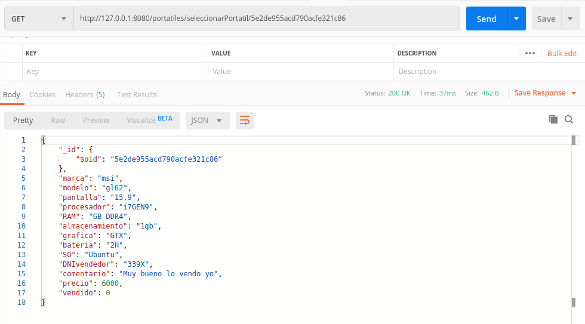

# Ejercicio 1

**Realizar una aplicación básica que use express para devolver alguna estructura de datos del modelo que se viene usando en el curso.**


Aprovechando lo realizado en los hitos de mi Proyecto de la asignatura, mostraré parte de una API REST, concretamente de la API REST de gestión de portatiles, el código es el siguiente:

```python  

import os

from flask import Flask
from flask import request
from flask import Response

from bson import json_util

from Portatiles import Portatiles
from MongoDM import MongoDM

app = Flask(__name__)

data_manager = MongoDM(os.environ['URI_BD_P'],os.environ['BD_P'],os.environ['CO_P'])
portatiles = Portatiles(data_manager)

#data_manager = MongoDM('localhost:27017','P','P')
#portatiles = Portatiles(data_manager)

#DE PRESENTACION
@app.route('/portatiles/')
def index():
    return Response(json_util.dumps("REST DE PORTATILES"), status=200, mimetype="application/json")

#PARA COMPROBAR
@app.route('/portatiles/numeroPortatilesEnBD', methods=['GET'])
def numeroPortatilesEnVenta():
    return Response(json_util.dumps(portatiles.numeroPortatilesEnBD()), status=200, mimetype="application/json")

#PARA COMPROBAR
@app.route('/portatiles/seleccionarPortatil/<_id>', methods=['GET'])
def seleccionarPortatil(_id):
    portatil = portatiles.seleccionarPortatil(_id)
    return Response(json_util.dumps(portatil), status=200, mimetype="application/json")


```
 Como he comentado anteriormente solo hay un trozo de esta API REST, concretamente el que nos interesa porque vamos a probar que funciona la ruta: portatiles/seleccionarPortatil/id_portatil, utilizando un id_portatil que sabemso qeu existe en nuestra base de datos, para esta comprobación utilizaremos *POSTMAN*, el resultado es el siguiente:

 

# Ejercicio 2

**Programar un microservicio en express (o el lenguaje y marco elegido) que incluya variables como en el caso anterior.**


En este caso también se ha utilizado el microservicio programado en mi proyecto de la asignatura, el cuál va de portátiles.

Este microservicio tiene varias capas, la base de datos, la lógica de negocio y la API REST. Los cuales están en los archivos [MongoDb.py](https://github.com/NSInductus/CC_Proyecto/blob/master/src/MongoDM.py), [Portatiles.py](https://github.com/NSInductus/CC_Proyecto/blob/master/src/Portatiles.py) y [Portatiles_rest.py](https://github.com/NSInductus/CC_Proyecto/blob/master/src/Portatiles_rest.py).

Para arrancarlo abriremos un terminal en la carpeta donde se encuentra la API REST y ejecutaremos el siguiente comando:


```shell
FLASK_APP=Portatiles_rest.py flask run

```

El resultado es el siguiente:

```
* Serving Flask app "Portatiles_rest.py"
* Environment: production
  WARNING: This is a development server. Do not use it in a production deployment.
  Use a production WSGI server instead.
* Debug mode: off
* Running on http://127.0.0.1:5000/ (Press CTRL+C to quit)

```

Después de esto nuestro servicio estará activo en la dirección indicada.

# Ejercicio 3

**Crear pruebas para las diferentes rutas de la aplicación.**

El fichero de los test, es el mismo que tenemos en el proyecto de la asignatura, el código es el siguiente:


```python

import pytest
import sys
import os

sys.path.append('src')

import json
from bson import json_util

import Portatiles_rest
from Portatiles import Portatiles
from MongoDM import MongoDM

def funcion_inicio():
    data_manager = MongoDM(os.environ['URI_BD_P'],os.environ['BD_P'],os.environ['CO_P'])
    portatiles = Portatiles(data_manager)
    portatiles.limpiarLista()

def funcion_fin():
    data_manager = MongoDM(os.environ['URI_BD_P'],os.environ['BD_P'],os.environ['CO_P'])
    portatiles = Portatiles(data_manager)
    portatiles.limpiarLista()

@pytest.fixture
def cliente_test():
    funcion_inicio()
    cliente_test = Portatiles_rest.app.test_client()
    Portatiles_rest.app.config['TESTING'] = test_prueba
    yield cliente_test
    funcion_fin()

def test_prueba(cliente_test):
    respuesta = cliente_test.get('/portatiles/')
    if (respuesta.status_code == 200):
        assert (respuesta.status_code == 200 and respuesta.headers["Content-Type"] == "application/json")
        assert json_util.loads(respuesta.data) == "REST DE PORTATILES"
    elif (respuesta.status_code == 413):
        assert (respuesta.status_code == 413)
    elif (respuesta.status_code == 414):
        assert (respuesta.status_code == 414)
    elif (respuesta.status_code == 429):
        assert (respuesta.status_code == 429)
    else:
        assert (respuesta.status_code == 412)

def test_rest_ruta_desconocida(cliente_test):
    respuesta = cliente_test.get('/portatiles/kokoko')
    if (respuesta.status_code == 204):
        assert (respuesta.status_code == 204)

def test_rest_numero_portatiles(cliente_test):
    respuesta = cliente_test.get('/portatiles/numeroPortatilesEnBD')
    if (respuesta.status_code == 200):
        assert (respuesta.status_code == 200 and respuesta.headers["Content-Type"] == "application/json")
        assert json_util.loads(respuesta.data) == 0
    elif (respuesta.status_code == 413):
        assert (respuesta.status_code == 413)
    elif (respuesta.status_code == 414):
        assert (respuesta.status_code == 414)
    elif (respuesta.status_code == 429):
        assert (respuesta.status_code == 429)
    else:
        assert (respuesta.status_code == 412)


def test_rest_agregar_portatil_y_seleccionar_version_corta(cliente_test):
    respuesta = cliente_test.post('/portatiles/agregarPortatil/msi/gl62/333X/600')
    if (respuesta.status_code == 200):
        assert (respuesta.status_code == 200 and respuesta.headers["Content-Type"] == "application/json")
        indice = json_util.loads(respuesta.data)
    elif (respuesta.status_code == 413):
        assert (respuesta.status_code == 413)
    elif (respuesta.status_code == 414):
        assert (respuesta.status_code == 414)
    elif (respuesta.status_code == 429):
        assert (respuesta.status_code == 429)
    else:
        assert (respuesta.status_code == 412)
    cadena = '/portatiles/seleccionarPortatil/' + indice
    respuesta = cliente_test.get(cadena)
    portatil = {"_id":{"$oid": indice}, "marca":"msi", "modelo":"gl62", "DNIvendedor":"333X", "precio":600, "pantalla":"", "procesador":"", "RAM":"", "almacenamiento":"", "grafica":"", "bateria":"", "SO":"",  "comentario":"", "vendido":0}
    if (respuesta.status_code == 200):
        assert (respuesta.status_code == 200 and respuesta.headers["Content-Type"] == "application/json")
        assert json.loads(respuesta.data) == portatil
    elif (respuesta.status_code == 413):
        assert (respuesta.status_code == 413)
    elif (respuesta.status_code == 414):
        assert (respuesta.status_code == 414)
    elif (respuesta.status_code == 429):
        assert (respuesta.status_code == 429)
    else:
        assert (respuesta.status_code == 412)

def test_rest_agregar_portatil_y_seleccionar_version_larga(cliente_test):
    respuesta = cliente_test.post('/portatiles/agregarPortatil/msi/gl62/333X/600/Muy%20bueno/15/i7/GB%20DDR4/1gb/GTX/2H/Linux')
    if (respuesta.status_code == 200):
        assert (respuesta.status_code == 200 and respuesta.headers["Content-Type"] == "application/json")
        indice = json_util.loads(respuesta.data)
    elif (respuesta.status_code == 413):
        assert (respuesta.status_code == 413)
    elif (respuesta.status_code == 414):
        assert (respuesta.status_code == 414)
    elif (respuesta.status_code == 429):
        assert (respuesta.status_code == 429)
    else:
        assert (respuesta.status_code == 412)
    cadena = '/portatiles/seleccionarPortatil/' + indice
    respuesta = cliente_test.get(cadena)
    portatil = {"_id":{"$oid": indice}, "marca":"msi", "modelo":"gl62", "DNIvendedor":"333X", "precio":600, "pantalla":"15", "procesador":"i7", "RAM":"GB DDR4", "almacenamiento":"1gb", "grafica":"GTX", "bateria":"2H", "SO":"Linux",  "comentario":"Muy bueno", "vendido":0}
    if (respuesta.status_code == 200):
        assert (respuesta.status_code == 200 and respuesta.headers["Content-Type"] == "application/json")
        assert json.loads(respuesta.data) == portatil
    elif (respuesta.status_code == 413):
        assert (respuesta.status_code == 413)
    elif (respuesta.status_code == 414):
        assert (respuesta.status_code == 414)
    elif (respuesta.status_code == 429):
        assert (respuesta.status_code == 429)
    else:
        assert (respuesta.status_code == 412)

def test_rest_modificar_portatil_solo_precio_y_seleccionar(cliente_test):
    respuesta = cliente_test.post('/portatiles/agregarPortatil/msi/gl62/333X/600')
    if (respuesta.status_code == 200):
        assert (respuesta.status_code == 200 and respuesta.headers["Content-Type"] == "application/json")
        indice = json_util.loads(respuesta.data)
    elif (respuesta.status_code == 413):
        assert (respuesta.status_code == 413)
    elif (respuesta.status_code == 414):
        assert (respuesta.status_code == 414)
    elif (respuesta.status_code == 429):
        assert (respuesta.status_code == 429)
    else:
        assert (respuesta.status_code == 412)
    cadena = '/portatiles/modificarPortatil/' + indice + '/5555'
    respuesta = cliente_test.put(cadena)
    if (respuesta.status_code == 200):
        assert (respuesta.status_code == 200 and respuesta.headers["Content-Type"] == "application/json")
    elif (respuesta.status_code == 413):
        assert (respuesta.status_code == 413)
    elif (respuesta.status_code == 414):
        assert (respuesta.status_code == 414)
    elif (respuesta.status_code == 429):
        assert (respuesta.status_code == 429)
    else:
        assert (respuesta.status_code == 412)
    portatil = {"_id":{"$oid": indice}, "marca":"msi", "modelo":"gl62", "DNIvendedor":"333X", "precio":5555, "pantalla":"", "procesador":"", "RAM":"", "almacenamiento":"", "grafica":"", "bateria":"", "SO":"",  "comentario":"", "vendido":0}
    cadena = '/portatiles/seleccionarPortatil/' + indice
    respuesta = cliente_test.get(cadena)
    if (respuesta.status_code == 200):
        assert (respuesta.status_code == 200 and respuesta.headers["Content-Type"] == "application/json")
        assert json.loads(respuesta.data) == portatil
    elif (respuesta.status_code == 413):
        assert (respuesta.status_code == 413)
    elif (respuesta.status_code == 414):
        assert (respuesta.status_code == 414)
    elif (respuesta.status_code == 429):
        assert (respuesta.status_code == 429)
    else:
        assert (respuesta.status_code == 412)

```

El código evidentemente no esta completo solo una parte para ser mostrado.

# Ejercicio 4

**Experimentar con diferentes gestores de procesos y servidores web front-end para un microservicio que se haya hecho con antelación, por ejemplo en la sección anterior.**


Rellenar ejercicio 4


# Ejercicio 5

**Usar rake, invoke o la herramienta equivalente en tu lenguaje de programación para programar diferentes tareas que se puedan lanzar fácilmente desde la línea de órdenes.**


Rellenar ejercicio 5
