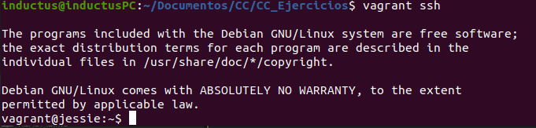

# Ejercicio 1

**Instalar una máquina virtual Debian usando Vagrant y conectar con ella.**

Para levantar la máquina virtual que nos pide el ejercicio con Vagrant, necesitaremos crear un archivo llamado Vagrantfile con el siguiente contenido:

```
Vagrant.configure("2") do |config|

    config.vm.box = "debian/jessie64"

    config.vm.provider "virtualbox" do |virtualbox|
        virtualbox.memory = 2048
        virtualbox.cpus = 2
    end

end
```

Una vez creado el archivo se ejecuta el siguiente comando:

```
vagrant up
```

La máquina ya estará levantada, para conectarnos a ella hacemos el siguiente comando:

```
vagrant ssh
```

Ya estaremos dentro de la maquina virtual a través de ssh como se ve en la siguiente captura de pantalla:



# Ejercicio 2

**Instalar una máquina virtual ArchLinux o FreeBSD para KVM, otro hipervisor libre, usando Vagrant y conectar con ella.**

Al igual que en el ejercicio anterior se utilizará Vagrantfile, así como también se utilizarán los mismos comandos, aunque el Vagrantfile se vere ligeramente modificado, concretamente la imagen base, por lo que queda así:

```
Vagrant.configure("2") do |config|

    config.vm.box = "freebsd/FreeBSD-12.0-CURRENT"

    config.vm.provider "virtualbox" do |virtualbox|
        virtualbox.memory = 2048
        virtualbox.cpus = 2
    end

end
```

# Ejercicio 3

**Crear un script para provisionar de forma básica una máquina virtual para el proyecto que se esté llevando a cabo en la asignatura.**

```
 Vagrant.configure("2") do |config|


    config.vm.box = "ubuntu/bionic64"

    config.vm.network "forwarded_port", guest: 8080, host: 8080
    config.vm.network "forwarded_port", guest: 8000, host: 8000

    config.vm.provider "virtualbox" do |virtualbox|
        virtualbox.memory = 2048
        virtualbox.cpus = 2
    end

    config.vm.provision "shell" do |s|
      s.inline = "echo hello"
    end

end
```

# Ejercicio 4

**Configurar tu máquina virtual usando `vagrant` con el provisionador ansible**

```
 Vagrant.configure("2") do |config|


    config.vm.box = "ubuntu/bionic64"

    config.vm.network "forwarded_port", guest: 8080, host: 8080
    config.vm.network "forwarded_port", guest: 8000, host: 8000

    config.vm.provider "virtualbox" do |virtualbox|
        virtualbox.memory = 2048
        virtualbox.cpus = 2
    end

    config.vm.provision "ansible" do |ansible|
        ansible.playbook = "./workstate.yml"
    end

end
```
